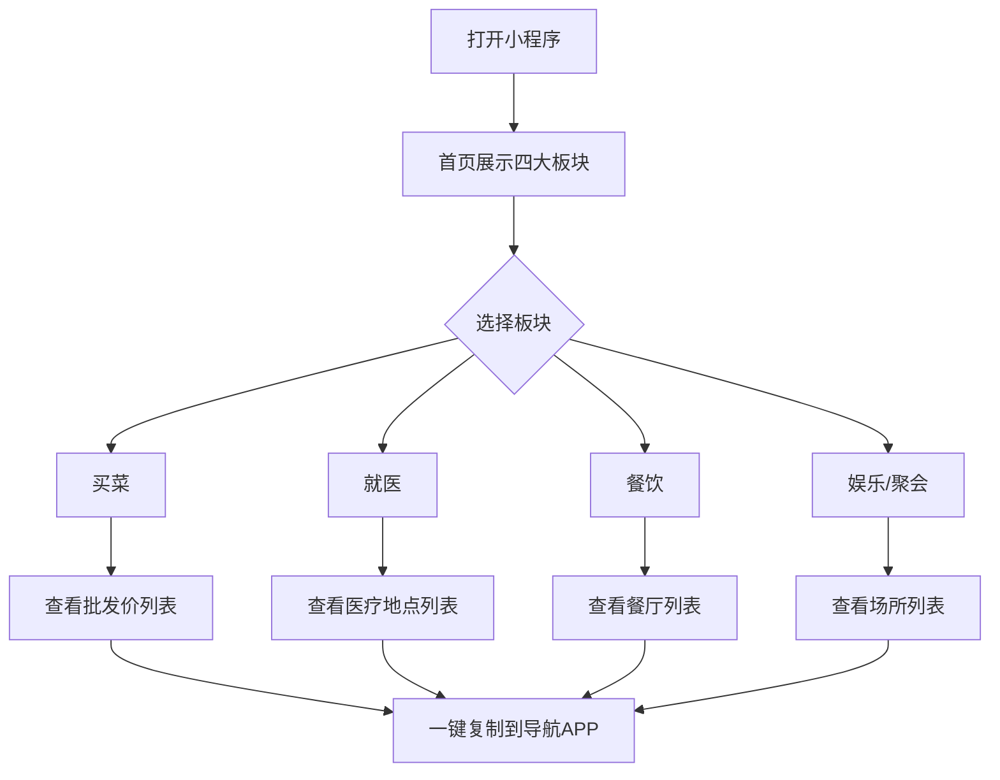
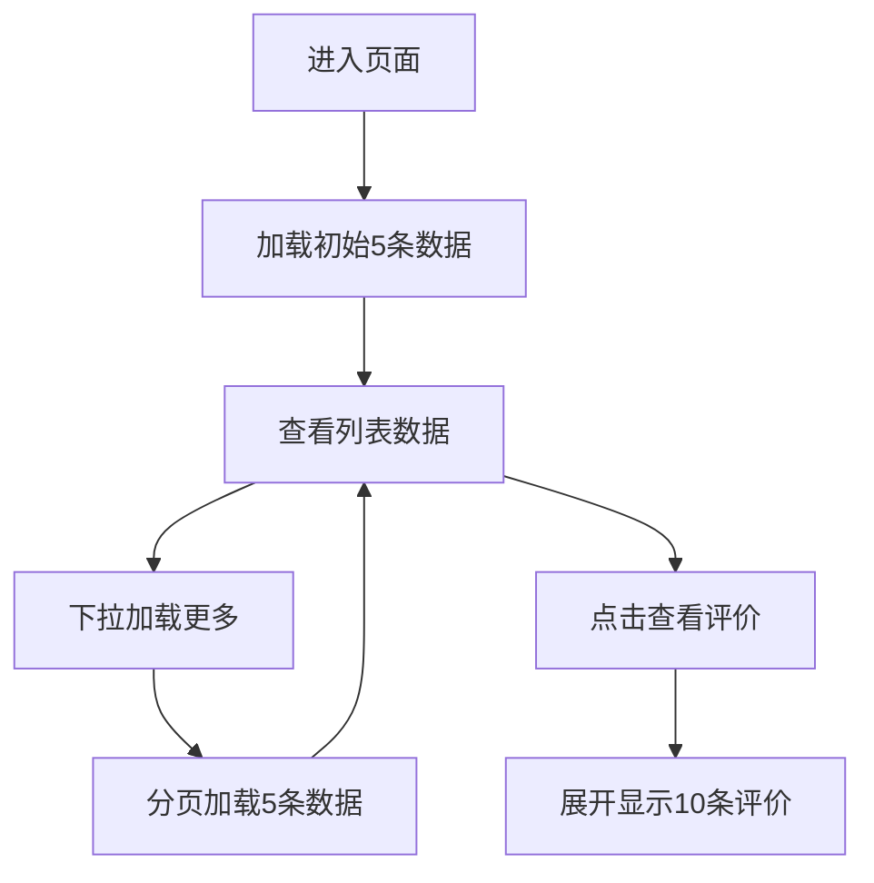

# 银川本地生活服务小程序 PRD

## 1. 产品概述

银川本地生活服务小程序是一款面向银川市民（尤其是老年用户）的综合性生活信息平台，提供菜蛋肉奶批发价查询、本地餐饮推荐、周边娱乐场所、医疗地点等便民服务。

- **核心目的**：解决银川市民日常生活中买菜、就餐、娱乐、就医等信息查询需求
- **目标用户**：银川市民，尤其侧重中老年用户群体
- **核心价值**：信息集中、操作简单、一目了然、服务本地化

## 2. 核心功能

### 2.1 用户角色

| 角色 | 注册方式 | 核心权限 |
|------|----------|----------|
| 普通用户 | 无需注册 | 浏览、查看、复制地址 |

### 2.2 功能模块

1. **首页**：四大核心板块入口（买菜、就医、餐饮、娱乐）
2. **买菜模块**：当日菜蛋肉奶批发价查询
3. **餐饮模块**：本地高评分餐厅推荐
4. **娱乐模块**：周边5km玩乐地点
5. **聚会模块**：聚会娱乐场所推荐
6. **医疗模块**：周边5km医疗地点（含社区医院及以上）

### 2.3 页面详情

| 页面名称 | 模块名称 | 功能描述 |
|----------|----------|----------|
| 首页 | 四大板块导航 | 买菜、就医、餐饮、娱乐入口，大图标大字展示 |
| 买菜页 | 价格列表 | 展示菜蛋肉奶批发价，固定四种图标 |
| 餐饮页 | 餐厅列表 | 展示高评分餐厅，含位置、推荐菜、消费价格 |
| 娱乐页 | 玩乐列表 | 周边5km玩乐地点，含价格、10条评价 |
| 聚会页 | 场所列表 | 聚会场所，含位置、价格、10条评价 |
| 医疗页 | 医疗列表 | 周边5km医疗地点，含社区医院及以上级别 |

## 3. 核心流程

### 3.1 主要用户流程

### 3.2 数据加载流程

## 4. 用户界面设计

### 4.1 设计风格

- **整体风格**：清爽简洁，大字版，适老化设计
- **主色调**：银川市市色
  - 主色：湖光蓝 #2E8B9A（代表银川湖泊）
  - 辅色：塞上绿 #3CB371（代表塞上江南生态）
  - 强调色：暖阳橙 #E8985A（代表温暖亲切）
  - 背景色：云白 #F8FAFB
- **按钮样式**：圆角大按钮，尺寸不小于 48px 高度
- **字体大小**：正文最小 18px，标题 24-32px
- **布局风格**：卡片式布局，模块化分区
- **图标风格**：简易线性图标，色彩统一

### 4.2 页面设计概览

| 页面名称 | 模块名称 | UI元素 |
|----------|----------|--------|
| 首页 | 四大板块 | 大图标 + 大文字，2x2 网格布局，圆角卡片 |
| 列表页 | 数据列表 | 卡片式列表，图标 + 标题 + 价格 + 地址 |
| 详情弹窗 | 评价列表 | 点击"其他人的评价"展开，列表展示 |

### 4.3 图标规范

| 类别 | 图标样式 | 颜色 |
|------|----------|------|
| 买菜（蔬菜） | 简易蔬菜图标 | 绿色 #3CB371 |
| 买菜（鸡蛋） | 简易鸡蛋图标 | 橙黄 #F4A460 |
| 买菜（肉类） | 简易肉类图标 | 红色 #E8985A |
| 买菜（牛奶） | 简易牛奶图标 | 白色 #FFFFFF |
| 就医 | 红十字图标 | 红色 #DC3545 |
| 餐饮 | 厨师帽图标 | 橙色 #E8985A |
| 娱乐 | 扑克牌图标 | 湖光蓝 #2E8B9A |
| 聚会 | 酒杯图标 | 紫色 #8B5CF6 |

### 4.4 响应式设计

- **移动优先**：专为手机端设计，优化触摸操作
- **触摸优化**：所有可点击区域不小于 48x48px
- **字体缩放**：支持系统字体大小调整

## 5. 数据规范

### 5.1 数据来源

- **买菜价格**：网络公开批发价数据（宁夏、银川批发市场公开数据）
- **餐饮信息**：高德地图、美团、大众点评等公开数据
- **娱乐场所**：高德地图、美团、大众点评等公开数据
- **医疗地点**：高德地图、国家卫健委公开数据

### 5.2 分页规则

- 初始加载：5 条数据
- 分页加载：下拉加载，每次加载 5 条数据
- 排序规则：按名称拼音字母顺序排序（A-Z）

### 5.2 评价显示规则

- 默认不显示评价
- 点击"其他人的评价"按钮展开评价列表
- 每次显示最近 10 条评价

### 5.3 地址复制功能

- 一键复制完整地址
- 复制成功后显示提示"地址已复制，可粘贴到导航APP"
- 支持复制后直接跳转外部导航应用

## 6. 功能优先级

| 优先级 | 功能模块 | 说明 |
|--------|----------|------|
| P0 | 首页四大板块 | 核心入口 |
| P0 | 买菜价格列表 | 每日更新 |
| P1 | 餐饮推荐列表 | 位置+推荐菜+价格 |
| P1 | 娱乐玩乐列表 | 5km范围+评价 |
| P1 | 聚会场所列表 | 评价展示 |
| P2 | 医疗地点列表 | 5km范围 |
