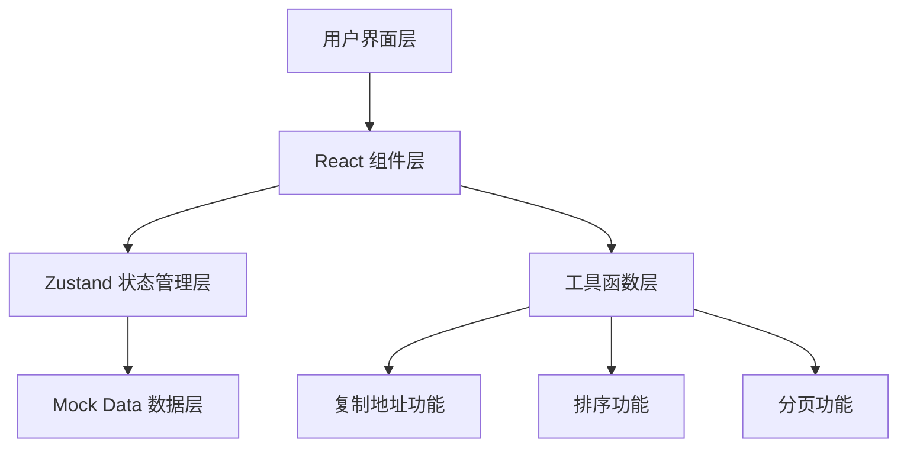

# 银川本地生活服务小程序技术架构文档

## 1. 架构设计



## 2. 技术选型

- **前端框架**：React 18 + TypeScript
- **构建工具**：Vite
- **样式方案**：Tailwind CSS
- **状态管理**：Zustand
- **路由管理**：React Router DOM v6
- **图标库**：Lucide React
- **数据源**：Mock Data（本地模拟数据）

## 3. 路由定义

| 路由路径 | 页面名称 | 功能描述 |
|----------|----------|----------|
| / | 首页 | 四大板块入口 |
| /shopping | 买菜页 | 菜蛋肉奶批发价 |
| /dining | 餐饮页 | 餐厅推荐列表 |
| /entertainment | 娱乐页 | 玩乐地点列表 |
| /party | 聚会页 | 聚会场所列表 |
| /medical | 医疗页 | 医疗地点列表 |

## 4. 数据模型

### 4.1 买菜数据模型

```typescript
interface ShoppingItem {
  id: string;
  name: string;
  category: 'vegetable' | 'egg' | 'meat' | 'milk';
  price: number;
  unit: string;
  market: string;
  updateTime: string;
}
```

### 4.2 餐饮数据模型

```typescript
interface Restaurant {
  id: string;
  name: string;
  namePinyin: string;
  address: string;
  rating: number;
  recommendedDishes: string[];
  avgPrice: number;
  distance?: number;
}
```

### 4.3 娱乐/聚会数据模型

```typescript
interface Entertainment {
  id: string;
  name: string;
  namePinyin: string;
  address: string;
  type: 'entertainment' | 'party';
  price: number;
  distance?: number;
  reviews: Review[];
}

interface Review {
  id: string;
  userName: string;
  content: string;
  rating: number;
  createTime: string;
}
```

### 4.4 医疗数据模型

```typescript
interface Medical {
  id: string;
  name: string;
  namePinyin: string;
  address: string;
  level: 'community' | 'district' | 'city';
  distance?: number;
  phone?: string;
}
```

## 5. 核心功能实现

### 5.1 分页功能

- 初始加载 5 条数据
- 下拉加载更多数据，每次加载 5 条
- 使用 slice() 方法实现数据分片
- 使用 Intersection Observer API 监听下拉加载

### 5.2 拼音排序

- 使用 localeCompare() 方法进行中文字符串拼音排序
- compareFn: (a, b) => a.namePinyin.localeCompare(b.namePinyin, 'zh-CN')

### 5.3 地址复制

- 使用 navigator.clipboard.writeText() API
- 提供用户友好的复制成功提示
- 支持跳转外部导航应用（高德、百度、腾讯地图）

### 5.4 评价展示

- 默认收起评价列表
- 点击"其他人的评价"按钮展开
- 每次显示最多 10 条评价

## 6. 组件结构

```
src/
├── components/
│   ├── layout/
│   │   └── Header.tsx
│   ├── common/
│   │   ├── IconCard.tsx
│   │   ├── InfoCard.tsx
│   │   ├── ReviewList.tsx
│   │   ├── CopyButton.tsx
│   │   └── InfiniteScroll.tsx
│   └── home/
│       └── CategoryGrid.tsx
├── pages/
│   ├── HomePage.tsx
│   ├── ShoppingPage.tsx
│   ├── DiningPage.tsx
│   ├── EntertainmentPage.tsx
│   ├── PartyPage.tsx
│   └── MedicalPage.tsx
├── data/
│   └── mockData.ts
├── utils/
│   ├── copyAddress.ts
│   └── pinyinSort.ts
├── store/
│   └── useAppStore.ts
└── types/
    └── index.ts
```

## 7. 性能优化

- 使用 React.memo() 优化组件渲染
- 使用 useCallback() 优化事件处理函数
- 图片懒加载（使用占位图标代替实物图片）
- 代码分割（按路由进行代码分割）

## 8. 适老化设计实现

- 最小触摸区域：48x48px
- 最小字体大小：18px
- 颜色对比度：WCAG AA 标准以上
- 按钮圆角：12px
- 卡片间距：16px
- 页面内边距：16px
